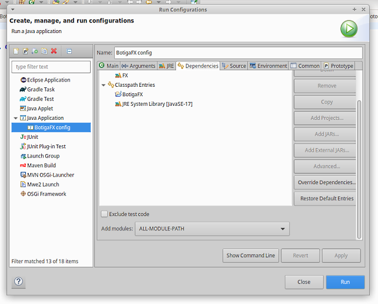

# JavaFX Shop - IES Badia - 2n DAW

## Contenidos
- [Introduccion](#Introduccion)
- [Instalacion](#Instalacion y configuracion)
- [Estructura](#Estructura)
- [Desarrollo](#Desarrollo)
- [Webgrafia](#Webgrafia)

## Introduccion
Este es un proyecto educativo, como alumno del centro IES Badia, y tiene como objetivo para aprender a utilizar la librería JavaFX. Se considera finalizado
El aplicativo consiste en una tienda dónde se pueden gestionar Personas y Productos o Packs. Al empezar, se accede a un menú para entrar en una de ellas. En sus pantallas se muestra un formulario para poder crear ya sean Personas o Productos. Más tarde se podría gestionar.

## Instalacion y configuracion
### Eclipse y JDK
Para desarrollar vamos a utilizar el entorno de eclipse, configuraremos las dependencias y el modo de ejecución adecuado para correr JavaFX. 
1. Instalamos eclipse a través de su página oficial ( https://www.eclipse.org/downloads/ )
2.Luego descargamos el SDK que se ejecutará desde eclipse.

3. Una vez hecho, entramos en Eclipse y vamoss al Market para instalar la extensión de FX

4. Descargamos las librerías necesarias para ejecutar JavaFX

5. Crear librería de usuario y asignar librerías FX para el proyecto

6. Ahora configuraremos el entorno de trabajo del proyecto
-	Arranque: asignamos un nombre para la configuración, establecemos qué proyecto es y cual es el objeto inicial por dónde comenzará la ejecución 

-	Argumentos: al iniciarse el proyecto tendrá en cuenta éstas dependencias gráficas para poder arrancar

-	Comprobamos que el entorno de ejecución sea el JDK adecuado

-	Por último, comprobar que las dependencias sean correcta y le decimos al programa que añada todos los módulos que estén en el proyecto (ALL-MODULE-PATH)

 
