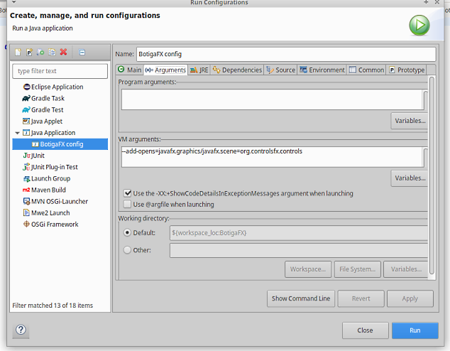

# JavaFX Shop - IES Badia - 2n DAW

## Contenidos
- [Introduccion](#Introduccion)
- [Instalacion y configuracion](#Instalacion-y-configuracion)
- [Estructura](#Estructura)
- [Desarrollo](#Desarrollo)
- [Webgrafia](#Webgrafia)

## Introduccion

 Este es un proyecto educativo, como alumno del centro IES Badia, y tiene como objetivo para aprender a utilizar la librería JavaFX. Se considera finalizado. 

 El aplicativo consiste en una tienda dónde se pueden gestionar Personas y Productos o Packs. Al empezar, se accede a un menú para entrar en una de ellas. En sus pantallas se muestra un formulario para poder crear ya sean Personas o Productos. Más tarde se podría gestionar. 

## Instalacion y configuracion
### Eclipse y JDK
Para desarrollar vamos a utilizar el entorno de eclipse, configuraremos las dependencias y el modo de ejecución adecuado para correr JavaFX. 
1. Instalamos eclipse a través de su página oficial ( https://www.eclipse.org/downloads/ )
2. Luego descargamos el SDK que se ejecutará desde eclipse.

3. Una vez hecho, entramos en Eclipse y vamoss al Market para instalar la extensión de FX

4. Descargamos las librerías necesarias para ejecutar JavaFX

5. Crear librería de usuario y asignar librerías FX para el proyecto

6. Ahora configuraremos el entorno de trabajo del proyecto
-	Arranque: asignamos un nombre para la configuración, establecemos qué proyecto es y cual es el objeto inicial por dónde comenzará la ejecución 

-	Argumentos: al iniciarse el proyecto tendrá en cuenta éstas dependencias gráficas para poder arrancar

-	Comprobamos que el entorno de ejecución sea el JDK adecuado

-	Por último, comprobar que las dependencias sean correcta y le decimos al programa que añada todos los módulos que estén en el proyecto (ALL-MODULE-PATH)

 
## Estructura
La distribución de proyecto está basada en el modelo MVC y sería la siguiente:
<ul>
<li><em>src</em>: contiene el código fuente</li>
<ul>
<li>modelo</li>
<ul>
<li>bo</li>
<li>dao</li>
</ul>
<li>vista</li>
<li>controlador</li>
</ul>
<li><em>lib</em>: almacena las dependencias</li>
<li><em>bin</em>: guarda ficheros para ejecutar</li>
 

 Dentro del src, en las vistas encontraremos también los ficheros de idiomas.
 

El modelo está formado por un gestor DAO (objetos de acceso de datos) y las clases que guardan datos, los BO (objetos de negocio).
 

## Desarrollo

 Se explicará el proceso para crear una vista utilizando SceneBuilder, explicando las nociones básicas necesarias del programa. Mostraremos los identificadores de cada elemento.
A continuación, asociaremos dicha vista, y sus elementos, con el controlador y mostraremos que métodos y cómo se manejan los eventos.
Luego, se verá las transacciones de datos entre controlador y modelo y, cómo éste último, maneja los datos.
Por último, se mostrará cómo se internacionaliza la aplicación. 

### Vista 
#### Inicio 

 Se compone por una base que es el AnchorPane de la cual se monta en un GridPane) y se posicionan 3 botones, uno para gestionar personas, otro para productos y, el último, para salir del aplicativo.
 

 Cada elemento tiene varias características. Cogiendo como ejemplo el botón Productos, tenemos 3 secciones:
 
<ul>
<li> <em>Properties</em> : maneja identificador o texto a mostrar, el estilo de texto… </li>
<li> <em>Code</em>: maneja diferentes eventos o acciones, identificador de código…</li>
<li> <em>Layout</em>: maneja el estilo de elemento (tamaños, márgenes…)</li>
</ul> 

 <b>fx:id</b> – identifica el elemento para que el controlador pueda reconocerlo 

 <b>On Action</b> – cuando realiza una acción sobre este elemento (clicar, dado que es un botón) mandará una señal al controlador asociado 

 

 Antes de terminar, abrimos el fichero fxml desde eclipse para asociar la vista al controlador adecuado como se puede ver en la siguiente imagen.

## Webgrafia 
<ul>
<li>Eclipse https://www.eclipse.org/downloads/</li>
<li> Openjdk 17 o 18</li>
<ul>
<li>https://gluonhq.com/products/javafx/</li>
<li>https://download2.gluonhq.com/openjfx/18/openjfx-18_linux-x64_bin-sdk.zip</li>
<li>https://openjdk.java.net/install/</li>
</ul>
<li>Librería librería org.controlsfx.org https://repo1.maven.org/maven2/org/controlsfx/controlsfx/11.1.1/controlsfx-11.1.1.jar/</li>
<li>SceneBuilder</li>
<ul>
